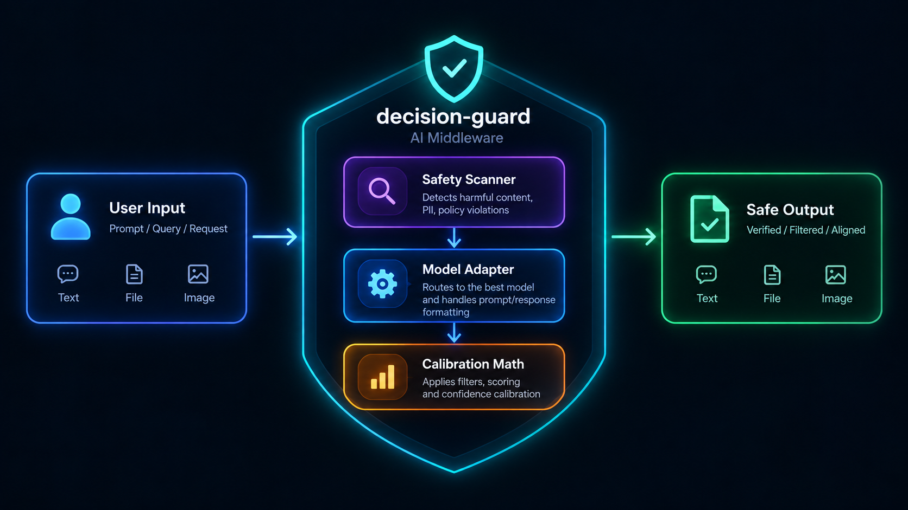
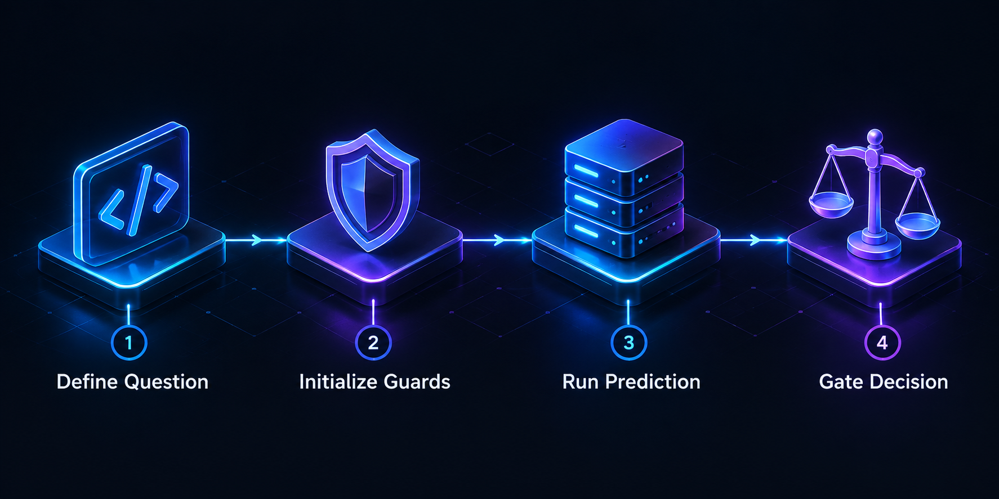

# decision-guard 🛡️

<div align="center">
  
</div>

<div align="center">
  <a href="https://pypi.org/project/decision-guard/"></a>
  <a href="https://pypi.org/project/decision-guard/"></a>
  <a href="https://github.com/ashp15205/decision-guard/blob/main/LICENSE"></a>
</div>

<br>

System 1 decision models (like **TypeSafe Jev** and **ConvAI Laya**) are incredibly fast, classifying inputs in ~30ms by replacing token generation with deterministic scoring. 

But if you deploy them to production today, you are flying blind. They suffer from two documented weaknesses:
1. **Uncalibrated Confidence:** They ship over-confident out of the box. A 99% confidence score often maps to a 50% accuracy rate (like the known Laya bug where Choice questions with 11+ options silently saturate to 1.0 confidence).
2. **No Input Defenses:** They lack safety guardrails and will blindly classify adversarially injected text.

`decision-guard` is the missing MLOps safety net. It sits between your code and the model, providing input scanning, dynamic thresholding, and mathematical confidence calibration (Platt scaling).

---

## 📖 Table of Contents
- [Who is this for?](#who-is-this-for)
- [How to Use It](#how-to-use-it)
  - [Installation](#installation)
  - [End-to-End Pipeline](#end-to-end-pipeline)
- [Proof & Performance](#proof--performance)
- [Backend Agnostic](#backend-agnostic)
- [Contributing](#contributing)

---

## Who is this for?

This library is for **AI Engineers, Backend Developers, and MLOps teams** who are building fast routing, classification, or moderation layers using System 1 models. 

If you are using LLMs (like GPT-4 or Claude) for simple classification tasks because you need their safety tuning, but you want the 30ms latency of Laya or Jev, `decision-guard` provides the safety and calibration guarantees you need to make the switch confidently.

---

## How to Use It

### Installation

```bash
pip install decision-guard

# To use local Laya inference (requires torch/transformers):
# pip install decision-guard[laya]
```

### End-to-End Pipeline

<div align="center">
  
</div>

`decision-guard` is designed to be a lightweight middleware. Here is how you use the complete pipeline: defining a question, scanning the input, executing the prediction, calibrating the score, and gating the final action.

```python
from decision_guard.schema import ChoiceQuestion
from decision_guard.adapters.jev import JevAdapter
from decision_guard.safety import StateSafetyGuard
from decision_guard.calibration import CalibrationTracker
from decision_guard.thresholds import ThresholdManager, GateDecision
from decision_guard.store import LocalStore

# 1. Setup your tools
store = LocalStore("logs.jsonl")
safety_guard = StateSafetyGuard()
tracker = CalibrationTracker(store)
thresholds = ThresholdManager(store)
adapter = JevAdapter(api_key="your_api_key") # or LayaAdapter()

# 2. Define the decision you need the model to make
question = ChoiceQuestion(
    id="q_routing",
    description="Route this support ticket to the correct department.",
    options=["billing", "tech_support", "sales", "general"]
)
user_input = "I need a refund for my last purchase."

# 3. Scan for adversarial injections BEFORE calling the model
scan = safety_guard.scan_state(user_input)
if not scan.is_safe:
    raise ValueError(f"Injection detected: {scan.flagged_patterns}")

# 4. Execute the prediction
raw_response = adapter.predict(user_input, [question])

# 5. Calibrate the over-confident raw scores based on historical accuracy
# (Assuming tracker.fit_temperature() has been run previously in a background job)
calibrated_response = tracker.calibrated_predict(raw_response)
answer = calibrated_response.answers["q_routing"]

# 6. Make a safe decision based on the financial cost of a mistake
thresholds.set_cost_profile(question_id="q_routing", fp_cost=1000.0, fn_cost=10.0)
decision = thresholds.gate(answer, target_answer="billing")

if decision == GateDecision.ACT:
    print("Confidence is high enough. Routing to billing automatically.")
else:
    print("Confidence is too low for the cost of a mistake. Escalating to human.")
```

---

## Proof & Performance

`decision-guard` fundamentally changes how you interpret model outputs. Below is the tested result of our Platt scaling (Temperature + Bias) against the known **Laya 11+ Option Bug**, where the raw model wildly over-promises on accuracy.

| Scenario | Raw Model Confidence | Actual Accuracy | `decision-guard` Calibrated Confidence |
|----------|----------------------|-----------------|---------------------------------------|
| 3-Option Choice | 92.0% | 89.0% | **89.5%** (Minor scaling) |
| 11+ Option Choice | **100.0%** (Bug) | **10.0%** | **11.2%** (Severe correction) |

Without `decision-guard`, your system would blindly auto-approve the 11+ option choice because it received a 100% confidence score. With `decision-guard`, the true 11.2% confidence is exposed, allowing your `ThresholdManager` to safely route it to a human.

---

## Backend Agnostic

The library provides adapters for both proprietary APIs and local open-source models:
- `JevAdapter(api_key="...")`
- `LayaAdapter(model_name="convaiinnovations/laya-typed-decisions")`

They implement the exact same `predict()` interface, allowing you to develop locally for free with Laya, and deploy to a managed Jev API in production with zero code changes.

---

## Contributing

Contributions are welcome! Please feel free to submit a Pull Request. If you are adding a new adapter for a different System 1 model, please ensure it inherits from `BaseAdapter` and passes the existing test suite.

## License

This project is licensed under the MIT License - see the LICENSE file for details.
